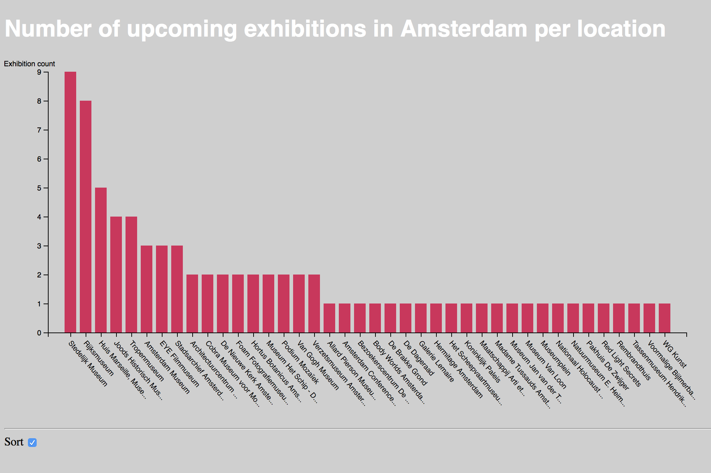

# Assessment 2 - Lucas Berghoef

In this assessment I cleaned data and added interaction to a bar chart by adding a checkbox that lets you order the data alphabetically and on count.

* Based on bar chart by Mike Bostock. - Link: [https://bl.ocks.org/mbostock/3885304]
* Based on the sorting function by Titus Wormer - Link: [https://github.com/cmda-fe3/course-17-18/tree/master/site/class-4/sort]
* Data by data.amsterdam.com - Link: [https://open.data.amsterdam.nl/Tentoonstellingen.csv]



## Background

Assessment 2 tests that I've attained the following knowledge:

* Previous goals
* Transform and clean data (subgoal 8)
* Manipulate elements (subgoal 9)
* Use data joins (subgoal 10)
* Create interactive visualisations (subgoal 11)

## Data

### Upcoming exhibition in Amsterdam

All exhibition in Amsterdam and the surrounding area as definined by "Amsterdam Marketing. This file gets updated daily with the latest Festivals and only contains upcoming Festivals, not past ones. (My version was downloaded on October 11th 2017) Data from [`data.amsterdam.nl`][https://open.data.amsterdam.nl/Tentoonstellingen.csv].

#### Download link

https://data.amsterdam.nl/#?dte=catalogus%2Fapi%2F3%2Faction%2Fpackage_show%3Fid%3D17249cfe-2696-4c94-a557-9e90ed5e23ac&dtfs=T&dsf=groups::toerisme-cultuur:res_format::CSV&mpb=topografie&mpz=11&mpv=52.3731081:4.8932945

#### Format

Comma-separated values (CSV) with 83 rows and 25 columns:

*   `Trcid` — (ex. "04197e05-4fde-441f-a3bc-69f758e76202")
*   `Title` — Title of the exhibition in Dutch
*   `Shortdescription` — A short description of the exhibition in Dutch
*   `Longdescription` — A long description of the exhibition in Dutch
*   `Calendarsummary` — A summary of the date, year and time when the exhibition takes place in Dutch
*   `TitleEN` — Title of the exhibition in English
*   `ShortdescriptionEN` — A short description of the exhibition in English
*   `LongdescriptionEN` — A long description of the exhibition in English
*   `CalendarsummaryEN` — A summary of the date, year and time when the exhibition takes place in English
*   `Types` — ...
*   `Ids` — ID numbers (ex. "2.4.1")
*   `Locatienaam` — The name of the exhibition location
*   `City` — The name of the city the exhibition is held in
*   `Adres` — The adress of the exhibition
*   `Zipcode` — The Zip code of the exhibition
*   `Latitude` — The latitude of the exhibition location
*   `Longitude` — The longitude of the exhibition location
*   `Urls` — The link to the website of the exhibition
*   `Media` — Media (images) of the exhibition
*   `Thumbnail` — A thumbnail image of the exhibition
*   `Datepattern_startdate` — ...
*   `Datepattern_enddate` — ...
*   `Singledates` — Date & year of the exhibition (DD-MM-YYYY)
*   `Type1` — ...
*   `Lastupdated` — When the exhibition information was last updated

#### Example

```csv
"Trcid";"Title";"Shortdescription";"Longdescription";"Calendarsummary";"TitleEN";"ShortdescriptionEN";"LongdescriptionEN";"CalendarsummaryEN";"Types";"Ids";"Locatienaam";"City";"Adres";"Zipcode";"Latitude";"Longitude";"Urls";"Media";"Thumbnail";"Datepattern_startdate";"Datepattern_enddate";"Singledates";"Type1";"Lastupdated";
"c3ce87d9-137d-4f24-88d7-4b253946ed09";"Nederlanders in Parijs";"Ontdek welke aantrekkingskracht de Franse hoofdstad had op Nederlandse kunstenaars in de 19e eeuw: George Breitner, Vincent van Gogh, Piet Mondriaan. Te zien van 13 oktober tot en met 7 januari 2018. ";"";"Vr 13 oktober 2017 t/m zo 7 januari 2018 ma-zo: geopend.";"Nederlanders in Parijs";"";"<h2></h2>";"Fr 13 October 2017 including Su 7 January 2018 Mo -Su: Open.";"";"2.3.14";"Van Gogh Museum";"AMSTERDAM";"Museumplein 6";"1071 DJ";"52,3564290";"4,8798010";"http://www.vangoghmuseum.nl/";"https://media.iamsterdam.com/ndtrc/Images/c3/c3ce87d9-137d-4f24-88d7-4b253946ed09/6bd1a145-46a6-4494-9c71-5e6ee18aa584.jpg";"https://media.iamsterdam.com/ndtrc/Images/c3/c3ce87d9-137d-4f24-88d7-4b253946ed09/6bd1a145-46a6-4494-9c71-5e6ee18aa584.jpg";"13-10-2017";"07-01-2018";"";"";"2017-02-13 11:24:15";
...
"2c96377a-2ac6-45b7-b511-32b5dcaab446";"De Dageraad";"De Dageraad is een van de hoogtepunten van de kunst- en architectuurstroming De Amsterdamse School.  Het bezoekerscentrum De Dageraad is onderdeel van het Amsterdamse School Museum Het Schip.";"Achter de golvende gevel van ... Een bezoek aan de expositie in het Bezoekerscentrum is gratis.";"Zo 1 januari 2017 t/m di 1 januari 2030 do-zo: 11:00 - 17:00 uur.";"De Dageraad";"";"";"Su 1 January 2017 including Tu 1 January 2030 Th -Su: 11:00 - 17:00 hour.";"";"2.3.14";"De Dageraad";"AMSTERDAM";"Burg Tellegenstraat";"1073 KG";"52,3501050";"4,8995780";"https://hetschip.nl/dageraad/932-bezoekerscentrum-de-dageraad-5";"https://media.ndtrc.nl/Images/2c/2c96377a-2ac6-45b7-b511-32b5dcaab446/d4ea2d1c-26f3-493b-82a5-534cb6893238.jpg";"https://media.ndtrc.nl/Images/2c/2c96377a-2ac6-45b7-b511-32b5dcaab446/d4ea2d1c-26f3-493b-82a5-534cb6893238.jpg";"01-01-2017";"01-01-2030";"";"";"2017-08-25 15:43:35";
```


## My changes in steps:  How I cleaned data & added Interaction

### 1. Cleaning the data
* After selecting the data I decided I wanted to filter the exhibitions per location in order to put them in a bar chart that can be sorted alphabetically and on count.
* With the code below I only returned objects that have a 'Locatienaam' because that is what my chart is based on on the x-axis.
* Once the chart was running I noticed there were unrecognized characters so I tried changing the parsing but after hours of trying it kept breaking the code. That's why I hard replaces the unrecognized character with 'ï'. See the code below.
* Once the chart was running I also noticed some location names were very long, that's why I cut off the strings and ended the with an ellipsis with the code below
```js 
d3.csv("data.csv", function (d) {
    if (d.Locatienaam) {
        if (d.Locatienaam.indexOf('\uFFFD') > -1) {
            d.Locatienaam = d.Locatienaam.replace('\uFFFD', 'ï'); // Find unrecognized character and replace it
        }
        if (d.Locatienaam.length > maxTextLength) {
            d.Locatienaam = `${d.Locatienaam.substring(0, maxTextLength)}...`; // Cut off strings longer than 20 characters and add ellipsis
        }
        return d; // Return the object if it has a 'Locatienaam'
    } else {
        return; // Don't return anything if it hasn't got a 'Locatienaam'
    }
```

### 2. Sorting the bar chart on location name (x) and number of exhibitions per location (y). 
* With the code below I set up the x-axis based on the location names (only if the object had a location name in the data)
* The y-axis is set up with the amount of exhibitions per location with the code below.
* I changed the range of the Y- axis manually because it started at 1, which caused many of the locations to not have a bar. That's why I changed it to 0.
```js 
  x.domain(locations.map(function (l) { return l.name; })); // Use the location names on the x axis
    let yRange = d3.extent(locations, function (l) { return l.values.length }); // Use the amount of exhibitions per location on the y axis. This sets the range
    yRange[0] = 0; // Alter the range to show all bars. Without this it would start the range at 1
    y.domain(yRange).nice();
```

### 3. Using enter to create rectangles for the bars in the barchart
The bars need to be created based on the y(l.values.length) by using the .enter function.
```js
g.selectAll(".bar")
        .data(locations)
        .enter().append("rect") // use enter to create rectangles for the bars
        .attr("class", "bar")
        .attr("x", function (l) { return x(l.name); })
        .attr("y", function (l) { return y(l.values.length); })
        .attr("width", x.bandwidth())
        .attr("height", function (l) { return height - y(l.values.length); });
```

### 4. Added an input to the html file
I've added an input to the html file. This input was needed to switch between the two different sorting modes. I included a label to make the input checkbox easier to click.
```html
<label for="sort">Sort</label>
<input type="checkbox" id="sort"/>
```

### 5. Added event listener in the js to monitor changes
Then I added an event listener to monitor changes to the input field.
```js
d3.select('input').on('change', onchange);
```

### 6. Added global var
I added a global variable for the data so it would be accesible to all helper functions.
```js
var data;

d3.tsv("data.tsv", function (d) {
    d.frequency = +d.frequency;
    return d;
}, function (error, d) {
    if (error) throw error;

    data = d; // Puts the data inside the global variable.
```

### 7. Making helper functions into an object called 'helper'
Because there were a lot of functions only performing a single task, I decided to put these functions in a different namespace. This helped me differentiate between built in functions and 'custom' helper functions. To achieve this, I created an object called `helper` and put all these functions inside it. The keys of the object functioned like function names, and the values were the actual functions.
```js
const helper = {
    /* Calculate `x` for a bar. */
    barX: function(d) {
        return x(helper.letter(d));
    },

    // etc...
}
```

### 8. Changing the reference to these 'helper' functions
* This ment I had to change all references to these functions. For example:
```js
var x0 = x.domain(data.sort(sort).map(helper.letter)).copy();
```

### 9. Styling the chart
Now it's time to add some styling to the chart to make it my own.
* Changed background color to light grey
* Added a H1 element in the html and changed the font to helvetica, the color to white.
* Changed the color of the bars to red/pink
* Changed the hovor color of the bars to cyan
* Changed the font of the label for the checkbox to helvetica.
* Rotated the labels on the x-axis to make them more readable. (they were overlapping)

## License

MIT © Lucas Berghoef
